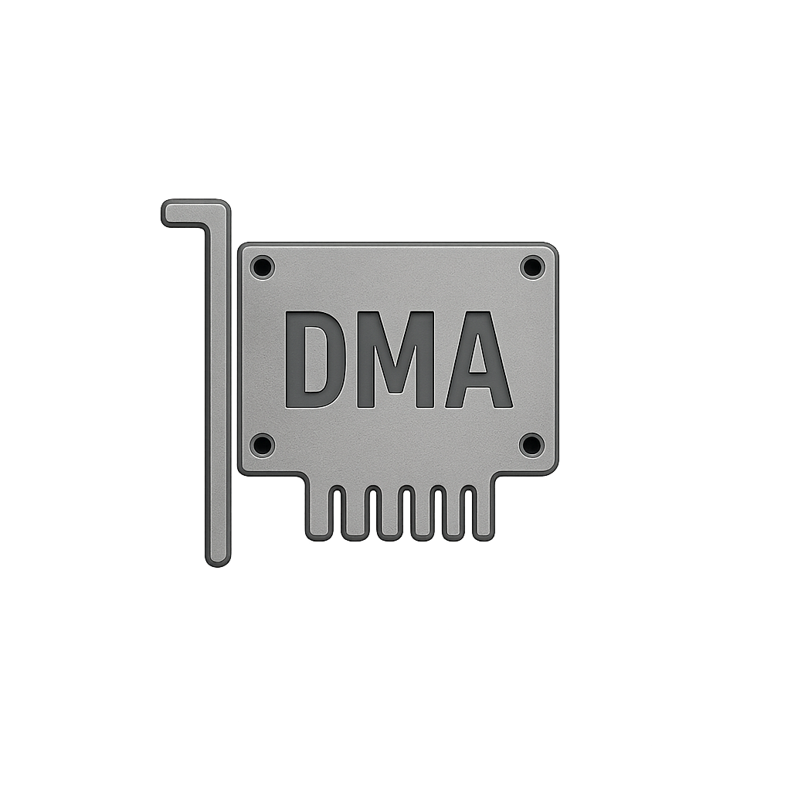

<p align="center">
  
</p>

<h1 align="center">DMA Engine</h1>

<p align="center">
  <strong>Free, open-source DMA overlay engine with multi-game support.</strong>
</p>

<p align="center">
  <a href="https://github.com/Skeelloo/releases/latest"></a>
  &nbsp;
  <a href="https://t.me/DMA_HUB"></a>
  &nbsp;
  <a href="https://github.com/Skeelloo"></a>
</p>

<p align="center">
  <a href="./README.md">English</a>
  &nbsp;&middot;&nbsp;
  <a href="./README_CN.md">中文</a>
</p>

<br/>

---

<br/>

## About

DMA Engine is a standalone DMA overlay tool built for FPGA-based DMA hardware. It ships as a single portable executable -- no installation, no .NET SDK, and no build tools required. Extract and run.

The application provides a clean Game Hub interface. Select your game, and the engine handles DMA initialization, process detection, and attachment automatically.

<br/>

## Supported Games

<table align="center">
  <thead>
    <tr>
      <th align="left">Game</th>
      <th align="center">Status</th>
    </tr>
  </thead>
  <tbody>
    <tr>
      <td>Arena Breakout Infinite</td>
      <td align="center"></td>
    </tr>
    <tr>
      <td>Counter-Strike 2</td>
      <td align="center"></td>
    </tr>
    <tr>
      <td>Delta Force</td>
      <td align="center"></td>
    </tr>
  </tbody>
</table>

<p align="center"><em>Additional games will be added over time.</em></p>

<br/>

## Features

| Feature | Description |
|:---|:---|
| **Automatic Setup** | DMA initialization, game detection, and process attachment are handled automatically. No manual configuration needed. |
| **ESP Overlay** | Per-game ESP with player boxes, names, distance, health, and skeleton rendering where applicable. |
| **Web Radar** | Built-in web radar for Arena Breakout Infinite, accessible from any device on your local network. |
| **Input Support** | Makcu device integration for hardware-level input forwarding. |
| **UPnP Port Mapping** | Automatic port forwarding for radar and network features. |
| **Per-Game Configs** | Settings saved per game in `%AppData%\DMAEngine` and persist between sessions. |
| **Lightweight** | Single-file executable with minimal resource usage. Fully self-contained, no .NET install required. |

<br/>

## Requirements

| Requirement | Details |
|:---|:---|
| **OS** | Windows 10 or Windows 11 (64-bit) |
| **Hardware** | FPGA-based DMA device (Squirrel, CaptainDMA, etc.) |
| **Firmware** | Device must be flashed and functional |
| **GPU** | Any GPU with DirectX 11 support |

> No .NET runtime installation is required. The release is fully self-contained.

<br/>

## Getting Started

```
1. Download the latest release from the Releases page
2. Extract the .zip to any folder
3. Run DMAEngine.exe
4. Select your game from the Game Hub
5. The engine initializes your DMA device and attaches automatically
```

Once attached, the overlay activates and ESP features are live based on your game configuration.

<br/>

## Configuration

All settings are stored in:

```
%AppData%\DMAEngine\<GameName>\config.json
```

Modify ESP toggles, colors, distances, and keybinds through the in-app settings panel. Changes save automatically.

<br/>

## Folder Structure

```
DMA Engine/
  |-- DMAEngine.exe          Main executable
  |-- Assets/                Fonts, icons, radar assets
  |-- vmm.dll                VMM library
  |-- leechcore.dll          LeechCore library
  |-- FTD3XX.dll             FTDI driver
  |-- (other native DLLs)
```

> Do not remove any `.dll` files from the folder. They are required for DMA communication and rendering.

<br/>

## Troubleshooting

<details>
<summary><strong>"DMA device not found"</strong></summary>
<br/>
Ensure your FPGA device is connected, powered, and has working firmware. Check Device Manager for the FTDI device.
</details>

<details>
<summary><strong>Overlay not appearing</strong></summary>
<br/>
Run <code>DMAEngine.exe</code> as Administrator. Some games with anti-cheat may require elevated privileges for the overlay to render.
</details>

<details>
<summary><strong>OBS / Discord not capturing the overlay</strong></summary>
<br/>
Run OBS or Discord with the same elevation level as DMA Engine. Disable "fullscreen optimizations" on the game executable.
</details>

<details>
<summary><strong>Antivirus flagging the executable</strong></summary>
<br/>
This is a false positive caused by the single-file publish and DMA library signatures. Add the folder to your antivirus exclusion list.
</details>

<br/>

## Credits

| | |
|:---|:---|
| **Mambo** | Original author of [MamboDMA](https://github.com/Mambo-Noob/MamboDMA) -- this project is forked from his work |
| **Lone** | [VmmSharpEx](https://github.com/LonePointer/VmmSharpEx) |
| **Marazm** | Maps and radar assets |

<br/>

## Disclaimer

> This software is provided for educational purposes only. The authors are not responsible for how it is used. Use at your own risk and in accordance with applicable terms of service.

<br/>

---

<p align="center">
  <a href="https://github.com/Skeelloo/releases/latest"></a>
  &nbsp;
  <a href="https://t.me/DMA_HUB"></a>
  &nbsp;
  <a href="https://github.com/Skeelloo"></a>
</p>
